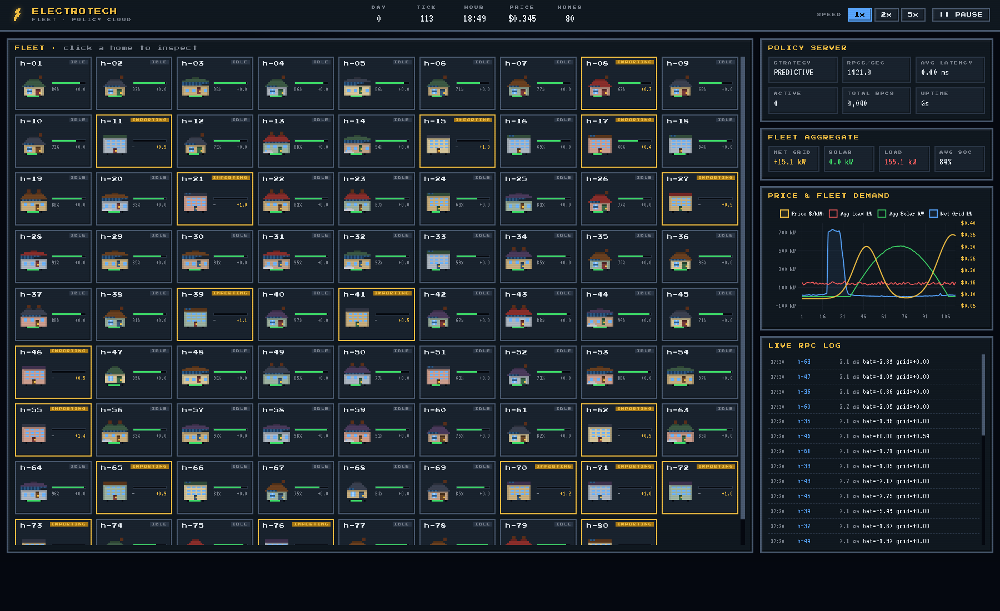

# ElectroTech

A home energy management simulator built in Go. Models a fleet of homes with solar panels and batteries that call a centralized gRPC policy server for strategic dispatch decisions.

## Architecture

```
┌─────────────────────────────────────────────┐
│          gRPC POLICY SERVER (:9001)         │
│  receives TickContext, returns decision     │
│  interceptor tracks latency + call volume   │
│  stateless — no per-home memory             │
└──────────────────┬──────────────────────────┘
                   │  concurrent RPCs over
                   │  a shared HTTP/2 connection
┌──────────────────┴──────────────────────────┐
│              HOME CLIENTS                    │
│  each home: solar + load + battery + RPC    │
│  20 archetypes from studio to McMansion     │
│  fleet driver fans out goroutines per tick  │
└──────────────────┬──────────────────────────┘
                   │  WebSocket (250ms broadcast)
┌──────────────────┴──────────────────────────┐
│            LIVE DASHBOARD (:8080)            │
│  pixel-art home grid, price chart,          │
│  RPC log, server stats, home inspector      │
└─────────────────────────────────────────────┘
```

## Dashboard



## Dispatch Strategies

| Strategy | Behavior |
|----------|----------|
| **Greedy** | Solar first, battery second, grid last. Price-blind. |
| **Reactive** | Charges battery from grid when price is cheap, greedy otherwise. |
| **Predictive** | 2-hour lookahead on price + solar forecast. Charges when price is below 85% of future average, discharges when above 115%. |

## Quick Start

```bash
# run the demo (1000 homes, predictive strategy)
go run ./cmd/demo

# open the dashboard
open http://localhost:8080

# customize
go run ./cmd/demo --homes 50 --strategy greedy --speed 5
```

### Flags

| Flag | Default | Description |
|------|---------|-------------|
| `--homes` | 1000 | Number of simulated homes |
| `--strategy` | predictive | `greedy`, `reactive`, or `predictive` |
| `--server-port` | 9001 | gRPC server port |
| `--dash-port` | 8080 | Dashboard HTTP port |
| `--speed` | 1.0 | Simulation speed multiplier |

## Project Structure

```
electrotech/
├── cmd/
│   ├── demo/              # single-process launcher
│   └── policy-server/     # standalone gRPC server
├── internal/
│   ├── sim/               # physics engine (solar, load, battery, pricing, strategies)
│   ├── policyserver/      # gRPC server + interceptor
│   ├── policypb/          # protoc-generated code
│   ├── home/              # home client + fleet driver
│   └── dashboard/         # WebSocket server + static frontend
└── proto/
    └── policy.proto       # service contract
```
